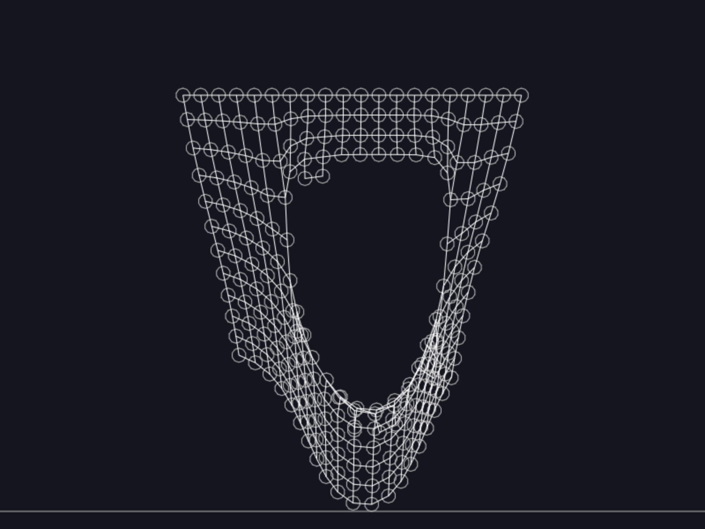

# Net simulation

Tried to create a flexible fabric simulation that would tear if you would yank
it too hard.

## Learning

I learned alot about 2D physics engines. This example
uses [matter.js](https://brm.io/matter-js/docs/). I red alot
about [toxiclibs](http://haptic-data.com/toxiclibsjs), but couldn't make it to
work with typescript.

## How to run this

* `npm install`
* `npm run dev`

## Result

it worked, i could probably play more with all the stiffness and damping
settings, but this is good enough result.
